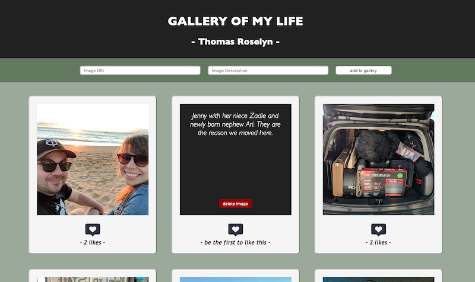

# Gallery of my Life

Gallery of my Life is my first full-stack React application. It allows the user to add new photos to the gallery and like or delete existing photos. It stores gallery items in a local database.

## Built With

React, Node.js, PostgreSQL

## Getting Started

These instructions will get you a copy of the project up and running on your local machine for development and testing purposes.

### Prerequisites

- [Node.js](https://nodejs.org/en/)
- [PostgresQL](https://www.postgresql.org/)
- [Postico](https://eggerapps.at/postico/)

### Installing

Steps to get the development environment running.

1. Download this project.
2. Set up a local PostgreSQL database called 'react_gallery'
3. Use the database.sql instructions to create a table in your database and insert the default data
4. In the terminal, `npm install` in the project folder
5. In the terminal, `npm run server`
6. In another terminal tab, `npm run client`

## Screen Shot

## Documentation

### Completed Features

App allows users to

- [x] Add a new gallery item using a target URL and item description
- [x] "Like" a photo using the like button and see the counter go up
- [x] Flip the photo card over to see its description, by clicking on it
- [x] Delete a photo from the gallery (available in the flipped/description state)

### Next Steps

- [ ] [Material UI](https://material-ui.com/)
- [ ] [Uppy](https://uppy.io/) integration

## Authors

* Thomas Roselyn

## Acknowledgments

* Prime Digital Academy
